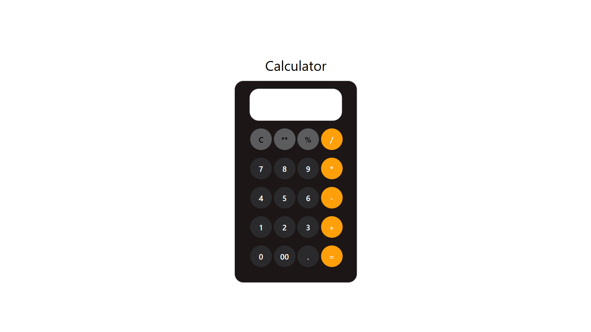

# Simple Calculator 🖩

A basic calculator built using **HTML, Tailwind CSS, and JavaScript**. It supports simple arithmetic operations with a clean and responsive design.

## 🚀 Features
- ✅ Addition (`+`)
- ✅ Subtraction (`-`)
- ✅ Multiplication (`*`)
- ✅ Division (`/`)
- ✅ Modulus (`%`)
- ✅ Exponentiation (`^`)
- 🎨 Responsive UI with Tailwind CSS
- 🔄 Clear (C) button to reset calculations

## 🛠️ Technologies Used
- **HTML** – For the structure
- **Tailwind CSS** – For styling and responsiveness
- **JavaScript** – For handling calculations and interactions

## 📸 Screenshot

---
Made by Prasad Nayak

